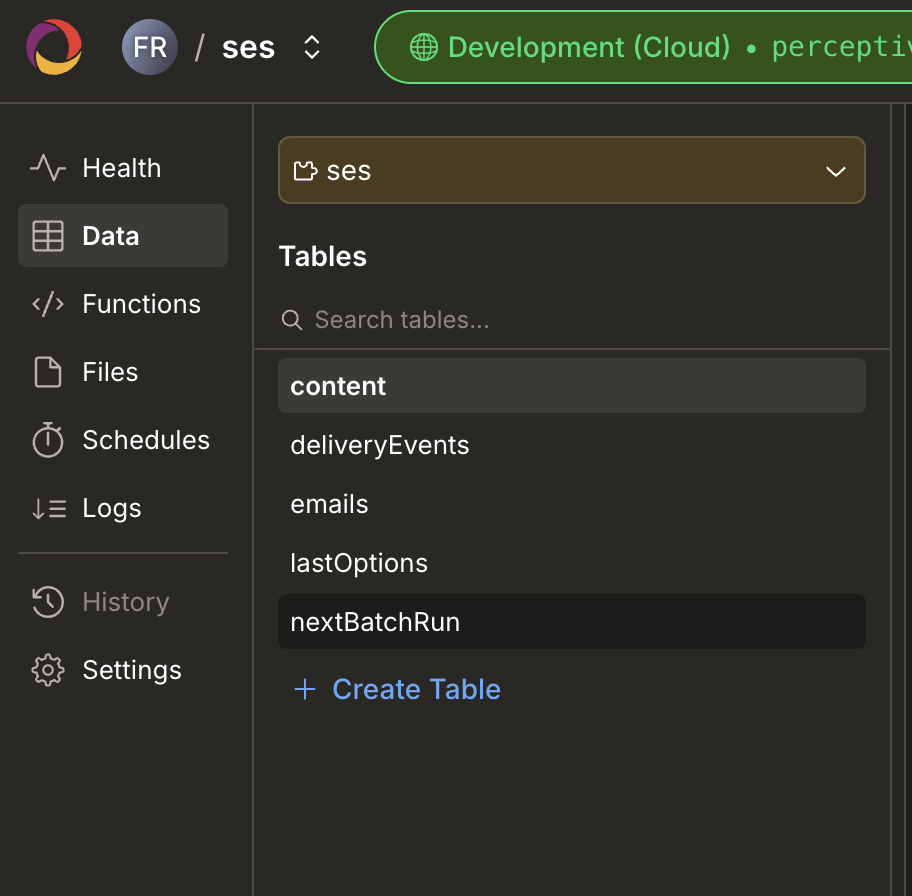

# AWS SES Convex Component

[](https://badge.fury.io/js/convex-aws-ses)

This component integrates AWS Simple Email Service (SES) with your Convex project.

Features:

- Queueing: Send as many emails as you want, as fast as you want—they'll all be
  delivered (eventually).
- Durable execution: Uses Convex workpools to ensure emails are eventually
  delivered, even in the face of temporary failures or network outages.
- Rate limiting: Honors AWS SES API rate limits.
- Event tracking: Receive delivery notifications via SNS webhooks.

See [example](./example) for a demo of how to incorporate this component into your
application.

## Installation

```bash
npm install convex-aws-ses
```

## Get Started

Set up your AWS credentials in your deployment environment:
- `AWS_REGION` (or `AWS_DEFAULT_REGION`)
- `AWS_ACCESS_KEY_ID`
- `AWS_SECRET_ACCESS_KEY`
- `SES_CONFIGURATION_SET_NAME` (optional, required for event tracking)
- `SES_PRODUCTION_MODE` (set to `true` to disable test mode and send to any address)
- `SES_DEBUG` (set to `true` to enable debug logging)

Next, add the component to your Convex app via `convex/convex.config.ts`:

```ts
import { defineApp } from "convex/server";
import ses from "convex-aws-ses/convex.config.js";

const app = defineApp();
app.use(ses);

export default app;
```

Then you can use it, as we see in `convex/sendEmails.ts`:

```ts
import { components } from "./_generated/api";
import { Ses } from "convex-aws-ses";
import { internalAction } from "./_generated/server";

export const ses: Ses = new Ses(components.ses, {});

export const sendTestEmail = internalAction({
  handler: async (ctx) => {
    await ses.sendEmail(ctx, {
      from: "sender@yourdomain.com",
      to: "recipient@example.com",
      subject: "Hi there",
      html: "This is a test email",
    });
  },
});
```

Then, calling `sendTestEmail` from anywhere in your app will send this test
email.

**Note:** In SES sandbox mode, both sender and recipient addresses must be
verified. Move to production mode to send to any address.

If you want to send emails to real addresses, you need to disable `testMode`.
You can do this in `SesOptions`,
[as detailed below](#ses-component-options-and-going-into-production).

## Advanced Usage

### Setting up SNS notifications for delivery events

While the setup we have so far will reliably send emails, you don't have any
feedback on anything delivering, bouncing, or triggering spam complaints. For
that, we need to set up SNS notifications!

1. Create an SNS topic in AWS console
2. Create a Configuration Set in SES and add the SNS topic as an event destination
3. Set `SES_CONFIGURATION_SET_NAME` environment variable

On the Convex side, we need to mount an http endpoint to our project to route it
to the SES component in `convex/http.ts`:

```ts
import { httpRouter } from "convex/server";
import { httpAction } from "./_generated/server";
import { ses } from "./sendEmails";

const http = httpRouter();

http.route({
  path: "/ses-notifications",
  method: "POST",
  handler: httpAction(async (ctx, req) => {
    return await ses.handleSnsNotification(ctx, req);
  }),
});

export default http;
```

If our Convex project is happy-leopard-123, we now have an SNS endpoint for our
project running at `https://happy-leopard-123.convex.site/ses-notifications`.

Subscribe your SNS topic to this HTTPS endpoint. The component will automatically
handle subscription confirmation.

You should now be seeing email status updates as SES makes progress on your
emails!

### Registering an email status event handler

If you have your SNS notifications established, you can also register an event
handler in your app to get notifications when email statuses change.

Update your `sendEmails.ts` to look something like this:

```ts
import { components, internal } from "./_generated/api";
import { internalMutation } from "./_generated/server";
import { vOnEmailEventArgs, Ses } from "convex-aws-ses";

export const ses: Ses = new Ses(components.ses, {
  onEmailEvent: internal.example.handleEmailEvent,
});

export const handleEmailEvent = internalMutation({
  args: vOnEmailEventArgs,
  handler: async (ctx, args) => {
    // Handle however you want
    // args provides { id: EmailId; event: EmailEvent; }
    // see /example/example.ts
  },
});
```

Check out the `example/` project in this repo for a full demo.

### SES component options, and going into production

There is a `SesOptions` argument to the component constructor to help
customize its behavior.

Check out the [docstrings](./src/client/index.ts), but notable options include:

- `region`: AWS region for SES (defaults to `AWS_REGION` env var)
- `accessKeyId`: AWS access key (defaults to `AWS_ACCESS_KEY_ID` env var)
- `secretAccessKey`: AWS secret key (defaults to `AWS_SECRET_ACCESS_KEY` env var)
- `configurationSetName`: SES Configuration Set name for event tracking
- `testMode`: Only allow delivery to verified addresses. To keep you safe as you
  develop your project, `testMode` is default **true**. You need to explicitly
  set this to `false` for the component to allow you to enqueue emails to
  arbitrary addresses.
- `onEmailEvent`: Your email event callback, as outlined above! Check out the
  [docstrings](./src/client/index.ts) for details on the events that are
  emitted.

### Optional email sending parameters

In addition to basic from/to/subject and html/plain text bodies, the `sendEmail`
method allows you to provide a list of `replyTo` addresses, `cc`, `bcc`, and
custom email headers.

### Using SES Templates

You can use SES templates to send emails with pre-designed templates from your
AWS account. To use a template, provide the template name and any required
template data:

```ts
await ses.sendEmail(ctx, {
  from: "sender@yourdomain.com",
  to: "recipient@example.com",
  template: {
    name: "MyTemplateName",
    data: {
      name: "John Doe",
      verificationLink: "https://example.com/verify?token=abc123",
    },
  },
});
```

> [!IMPORTANT] You cannot use both `template` and `html`/`text` in the same
> email. If you need to send dynamic HTML content, either use templates with
> template data, or use the `html`/`text` fields directly.

### Tracking, getting status, and cancelling emails

The `sendEmail` method returns a branded type, `EmailId`. You can use this for a
few things:

- To reassociate the original email during status changes in your email event
  handler.
- To check on the status any time using `ses.status(ctx, emailId)`.
- To cancel the email using `ses.cancelEmail(ctx, emailId)`.

If the email has already been sent to the SES API, it cannot be cancelled.
Cancellations do not trigger an email event.

#### Checking email status programmatically

Use the `status` method to check an email's current state:

```ts
const emailStatus = await ses.status(ctx, emailId);
if (emailStatus) {
  console.log(emailStatus.status); // e.g., "delivered", "bounced", "sent"
  console.log(emailStatus.bounced); // boolean
  console.log(emailStatus.failed); // boolean
  console.log(emailStatus.complained); // spam complaint (boolean)
  console.log(emailStatus.deliveryDelayed); // boolean
  console.log(emailStatus.opened); // if open tracking enabled (boolean)
  console.log(emailStatus.clicked); // if click tracking enabled (boolean)
  console.log(emailStatus.errorMessage); // error details (string | null)
}
```

#### Viewing emails and delivery events in the dashboard

You can view all email data directly in your Convex dashboard in the component's
data view. Click the drop down with a puzzle piece that says app:



1. **Emails table**: Navigate to your Convex dashboard → Data. Choose `ses`
   from the component drop down then choose the `emails` table. This shows all
   emails with their current status, recipients, subjects, and tracking
   information.

2. **Delivery Events table**: Navigate to Components → `ses` →
   `deliveryEvents` table. This table stores all SNS events received from
   SES, including:
   - `emailId`: Links back to the email in the emails table
   - `sesMessageId`: SES's ID for the email
   - `eventType`: The type of event (e.g., `Delivery`, `Bounce`,
     `Open`, `Click`, `Complaint`)
   - `createdAt`: When the event occurred
   - `message`: Additional details (e.g., bounce reasons)

This is useful for debugging delivery issues, viewing email history, and
understanding what happened with each email you sent.

### Data retention

This component retains "finalized" (delivered, cancelled, bounced) emails. It's
your responsibility to clear out those emails on your own schedule. You can run
`cleanupOldEmails` and `cleanupAbandonedEmails` from the dashboard, under the
"ses" component tab in the function runner, or set up a cron job.

If you pass no argument, it defaults to deleting emails older than 7 days.

If you don't care about historical email status, the recommended approach is to
use a cron job, as shown below:

```ts
// in convex/crons.ts
import { cronJobs } from "convex/server";
import { components, internal } from "./_generated/api.js";
import { internalMutation } from "./_generated/server.js";

const crons = cronJobs();
crons.interval(
  "Remove old emails from the SES component",
  { hours: 1 },
  internal.crons.cleanupSes,
);

const ONE_WEEK_MS = 7 * 24 * 60 * 60 * 1000;
export const cleanupSes = internalMutation({
  args: {},
  handler: async (ctx) => {
    await ctx.scheduler.runAfter(0, components.ses.lib.cleanupOldEmails, {
      olderThan: ONE_WEEK_MS,
    });
    await ctx.scheduler.runAfter(
      0,
      components.ses.lib.cleanupAbandonedEmails,
      // These generally indicate a bug, so keep them around for longer.
      { olderThan: 4 * ONE_WEEK_MS },
    );
  },
});

export default crons;
```

### Using React Email

You can use [React Email](https://react.email/) to generate your HTML for you
from JSX.

First install the
[dependencies](https://react.email/docs/getting-started/manual-setup#2-install-dependencies):

```bash
npm install @react-email/components react react-dom react-email @react-email/render
```

Then create a new .tsx file in your Convex directory e.g. `/convex/emails.tsx`:

```tsx
// IMPORTANT: this is a Convex Node Action
"use node";
import { action } from "./_generated/server";
import { render, pretty } from "@react-email/render";
import { Button, Html } from "@react-email/components";
import { components } from "./_generated/api";
import { Ses } from "convex-aws-ses";

export const ses: Ses = new Ses(components.ses, {
  testMode: false,
});

export const sendEmail = action({
  args: {},
  handler: async (ctx, args) => {
    // 1. Generate the HTML from your JSX
    // This can come from a custom component in your /emails/ directory
    // if you would like to view your templates locally. For more info see:
    // https://react.email/docs/getting-started/manual-setup#5-run-locally
    const html = await pretty(
      await render(
        <Html>
          <Button
            href="https://example.com"
            style={{ background: "#000", color: "#fff", padding: "12px 20px" }}
          >
            Click me
          </Button>
        </Html>,
      ),
    );

    // 2. Send your email as usual using the component
    await ses.sendEmail(ctx, {
      from: "sender@yourdomain.com",
      to: "recipient@example.com",
      subject: "Hi there",
      html,
    });
  },
});
```

> [!WARNING] React Email requires some Node dependencies thus it must run in a
> Convex
> [Node action](https://docs.convex.dev/functions/actions#choosing-the-runtime-use-node)
> and not a regular Action.

### Sending emails manually

If you need fine-grained control over the email sending process, you can send
emails manually using `sendEmailManually`. Unlike `sendEmail` which enqueues
emails and sends them via the batching system, `sendEmailManually` lets you
call the SES API directly while still tracking progress using the component's
status and event APIs.

```ts
import { components, internal } from "./_generated/api";
import { internalAction } from "./_generated/server";
import { Ses } from "convex-aws-ses";
import {
  SESv2Client,
  SendEmailCommand,
} from "@aws-sdk/client-sesv2";

const sesClient = new SESv2Client({
  region: process.env.AWS_REGION,
  credentials: {
    accessKeyId: process.env.AWS_ACCESS_KEY_ID!,
    secretAccessKey: process.env.AWS_SECRET_ACCESS_KEY!,
  },
});

export const ses = new Ses(components.ses, {});

export const sendManualEmail = internalAction({
  args: {},
  handler: async (ctx, args) => {
    const from = "sender@yourdomain.com";
    const to = ["recipient@example.com"];
    const subject = "hello world";
    const html = "<p>it works!</p>";

    const emailId = await ses.sendEmailManually(
      ctx,
      { from, to, subject },
      async (emailId) => {
        const command = new SendEmailCommand({
          FromEmailAddress: from,
          Destination: { ToAddresses: to },
          Content: {
            Simple: {
              Subject: { Data: subject },
              Body: { Html: { Data: html } },
            },
          },
          ConfigurationSetName: process.env.SES_CONFIGURATION_SET_NAME,
        });

        const response = await sesClient.send(command);
        if (!response.MessageId) {
          throw new Error("No MessageId returned from SES");
        }
        return response.MessageId;
      },
    );
    return emailId;
  },
});
```

Use `sendEmailManually` when you need features not supported by the standard
API, such as attachments, or when you want to send an email immediately without
waiting for the batching system.
